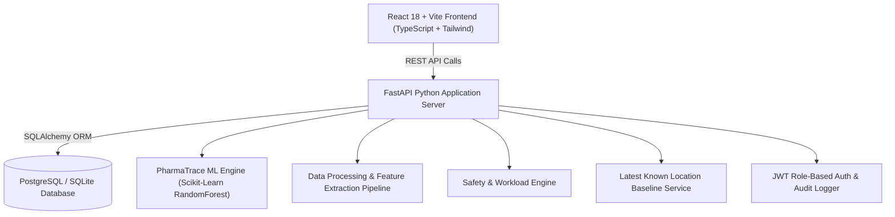

# PharmaTrace - System Architecture & Engineering Documentation

## 1. Architectural Overview

PharmaTrace is a high-reliability full-stack inventory location discrepancy finder engineered for pharmaceutical warehouses with controlled storage zones.

The application follows a decoupled multi-tier microservices architecture:

---

## 2. Core Components

### 2.1 Database Tier (`backend/app/models/models.py`)
- **Engine**: SQLAlchemy ORM with PostgreSQL driver (`psycopg2-binary`) and instant SQLite fallback for local developer setups.
- **Relational Schemas**: `inventory`, `location_master`, `putaway_scans`, `move_events`, `pick_failures`, `cycle_counts`, `workers`, `drivers`, `predictions`, `discrepancies`, `assignments`, `users`, `validation_feedback`, `audit_logs`.

### 2.2 Data Processing & Feature Engineering (`backend/app/ml/feature_engineering.py`)
Extracts candidate location features across warehouse event history:
- `scan_recency` & `movement_recency`
- `movement_frequency`
- `previous_location_match`
- `pick_failure_signal`
- `cycle_count_signal` & `quantity_match`
- `storage_compatibility` (Cold Storage vs Ambient vs Controlled Access)
- `location_available` & `location_status`
- `location_distance` proxy
- `recent_activity_count`

### 2.3 Prediction Engine (`backend/app/ml/prediction_engine.py`)
- **Scikit-Learn RandomForestClassifier** trained on candidate location feature vectors.
- Fuses model output with heuristic weighting for hard constraints (e.g. storage incompatibility = 0 probability penalty).
- Returns Top-1 and Top-3 candidate locations, calibrated confidence %, and data-backed explanations.

### 2.4 Safety & Workload Engine (`backend/app/services/safety_fairness.py`)
- **Hard Safety Rules**: Overrides operational efficiency if safety rules are breached.
- Validates:
  1. Shift status (`ACTIVE` required)
  2. Task workload limit (`current_tasks < max_tasks`)
  3. Accumulated walking distance (`current_distance < max_distance`)
  4. Zone security clearance (`authorized_zones` check)
  5. Restricted location clearance
  6. Physical location status (`BLOCKED` or `MAINTENANCE` rejection)

### 2.5 Baseline Model (`backend/app/services/baseline_service.py`)
- **Latest Known Location**: Evaluates the latest recorded scan or move event for an SKU.

---

## 3. Storage Zone Matrix & Security Control

| Storage Zone | Required Temp | Allowed Product Types | Restricted Access |
|---|---|---|---|
| **AMBIENT** | AMBIENT_20C | General Oral Medicines | Standard |
| **COLD_STORAGE** | COLD_4C | Vaccines & Insulin | Temperature Monitored |
| **QUARANTINE** | AMBIENT_20C | Hazardous / Expired Lots | Secure Bin |
| **HIGH_VALUE** | CONTROLLED_15C | Biologics & High-Cost SKUs | Lead Clearance |
| **CONTROLLED_ACCESS**| COLD_4C / FROZEN | Controlled Substances / Narcotics | Security Authorized |

---

## 4. Deployment Model
- Containerized via `docker-compose.yml` hosting `postgres`, `backend` (FastAPI), and `frontend` (Nginx/Vite).
