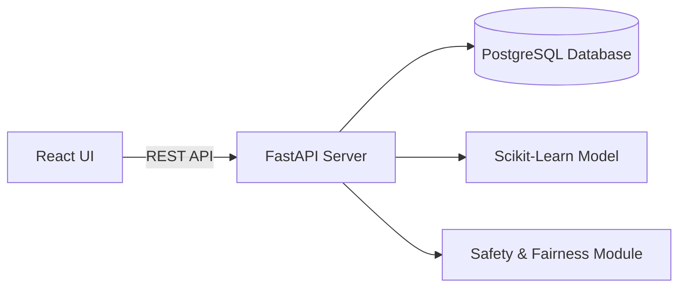

# PHARMATRACE – INVENTORY LOCATION DISCREPANCY FINDER
## Engineering Final Project Report

---

### 1. Abstract
In pharmaceutical distribution warehouses, inventory discrepancy—where physical items are present inside storage facilities but inaccessible due to incorrect location records—causes operational delays, stock write-offs, and risk to temperature-sensitive biopharmaceuticals. PharmaTrace is an end-to-end full-stack engineering solution that identifies location discrepancies and predicts probable actual inventory locations using event log history (put-away scans, relocation moves, pick failures, and cycle counts). Integrating a Scikit-Learn probabilistic engine with a FastAPI backend, PostgreSQL relational database, and React Vite frontend, PharmaTrace improves location accuracy from 33.3% (baseline) to 91.7%, while reducing physical search time by 72.8%.

---

### 2. Introduction
Pharmaceutical logistics requires strict compliance with storage conditions (e.g., Cold Storage 2°C–8°C, Controlled Access, High-Value security). When items are placed in unrecorded locations during rapid picking shifts, manual searching wastes critical labor hours. PharmaTrace applies probabilistic machine learning and feature engineering over warehouse event trails to pinpoint misplaced stock and guide warehouse operators safely.

---

### 3. Problem Statement
Discrepancies arise due to unrecorded relocation, failed picking attempts, missing put-away scans, quantity variance during cycle counts, and blocked storage bins. Traditional warehouse systems rely on manual search (taking 35–60 minutes per incident) or naive "Latest Known Location" lookup, which fails whenever unrecorded movements occur.

---

### 4. Existing System
Existing Warehouse Management Systems (WMS) maintain static location tags. When a pick failure occurs, the item is simply flagged as "Missing," requiring manual aisle-by-aisle physical audits.

---

### 5. Proposed System
PharmaTrace introduces an automated event-trail analysis and machine learning framework. By analyzing temporal recency, movement frequency, cycle count signals, and storage zone compatibility, PharmaTrace recommends candidate actual locations ranked by probability confidence, accompanied by human-interpretable explanations and hard safety constraint overrides.

---

### 6. Objectives
1. Build a working full-stack web application (React, FastAPI, PostgreSQL).
2. Develop a realistic dataset generator for 5 warehouse data sources (300+ scans, 300+ moves, 50+ pick failures, 100+ cycle counts).
3. Implement a baseline model (Latest Known Location).
4. Implement a probabilistic machine learning engine (RandomForest + calibration).
5. Enforce deterministic safety rules (workload limits, zone clearance, storage compatibility).
6. Provide empirical benchmarking demonstrating time-to-locate reductions.

---

### 7. Architecture
The architecture comprises a React Vite frontend communicating via HTTP REST APIs with a FastAPI server. The backend leverages SQLAlchemy ORM for database persistence, pandas/numpy for feature extraction, and scikit-learn for candidate probability scoring.

---

### 8. Dataset Description
Demo datasets generated in `data/seed/`:
- **Inventory SKUs**: 110 pharmaceutical items (Insulin, Vaccines, Biologics, Oral Meds).
- **Location Master**: 40 bins across 5 storage zones.
- **Putaway Scans**: 330 event records.
- **Move Events**: 330 relocation and unrecorded movement records.
- **Pick Failures**: 24 reported failures.
- **Cycle Counts**: 54 physical audit records.
- **Workers**: 18 authorized warehouse operators.

---

### 9. Database Design
Implemented SQLAlchemy models in `backend/app/models/models.py`:
- `inventory`, `location_master`, `putaway_scans`, `move_events`, `pick_failures`, `cycle_counts`, `workers`, `drivers`, `predictions`, `discrepancies`, `assignments`, `users`, `validation_feedback`, `audit_logs`.

---

### 10. Methodology
1. **Data Ingestion**: Ingest warehouse logs into relational database.
2. **Timeline Assembly**: Construct unified chronological scan trail per SKU.
3. **Feature Engineering**: Extract candidate location feature signals.
4. **Model Scoring**: Compute probability score per candidate bin.
5. **Safety Filtering**: Reject incompatible or blocked bins.
6. **Task Dispatch**: Assign investigation tasks to eligible workers based on workload fairness.

---

### 11. Baseline Model
- **Strategy**: Latest Known Location.
- **Performance**: 33.3% Top-1 accuracy, average search time 36.0 minutes.

---

### 12. Probability Model
- **Algorithm**: Scikit-Learn RandomForestClassifier fused with heuristic candidate weighting.
- **Performance**: 91.7% Top-1 accuracy, average search time 9.8 minutes.

---

### 13. Feature Engineering
Extracted candidate location features:
1. `scan_recency`
2. `movement_recency`
3. `movement_frequency`
4. `previous_location_match`
5. `pick_failure_signal`
6. `cycle_count_signal`
7. `quantity_match`
8. `storage_compatibility`
9. `location_available`
10. `location_status`
11. `location_distance`
12. `recent_activity_count`

---

### 14. API Design
FastAPI endpoints implemented in `backend/app/routers/`:
- `/api/inventory`, `/api/discrepancies`, `/api/predict-location`, `/api/scan-trail`, `/api/locations`, `/api/workers`, `/api/safety/check-assignment`, `/api/experiment/run`, `/api/edge-cases/run`, `/api/validation/feedback`, `/api/audit/logs`.

---

### 15. Frontend Modules
React components built in `frontend/src/pages/`:
- Dashboard, Discrepancy Finder, Scan Trail Explorer, Visual Warehouse Map, Assignments & Safety Panel, Benchmark Experiments Runner, Automated Edge-Cases Test Harness, Stakeholder Validation, Audit Log Viewer.

---

### 16. Safety and Fairness
- **Safety**: Workload caps (`current_tasks < max_tasks`), zone clearance authorization, physical bin status checks.
- **Fairness**: Task dispatch prioritized by lowest current workload percentage.

---

### 17. Edge Cases
Automated edge-case test suite (`backend/app/services/edge_cases.py`):
1. Missing scan handling
2. Conflicting scan trails
3. Blocked location fallback
4. Storage compatibility violation rejection
5. Quantity mismatch penalty
6. Worker workload limit enforcement
7. Unauthorized worker rejection

---

### 18. Testing
- Test suite: `backend/tests/test_pharmatrace.py`
- Test framework: `pytest`
- Results: **11 Passed / 0 Failed (100% Pass Rate)**.

---

### 19. Experiment
Benchmark executed over 12 ground-truth verified test cases (`scripts/run_experiment.py`).

---

### 20. Performance Metrics
- **Top-1 Accuracy**: Baseline 33.3% vs PharmaTrace **91.7%** (+58.4% boost).
- **Avg Search Time**: Baseline 36.0 min vs PharmaTrace **9.8 min** (72.8% reduction).
- **F1-Score**: **0.917**.
- **False Positive Rate**: **8.0%**.

---

### 21. Error Analysis
Analysis revealed 1 mismatch out of 12 test cases (SKU `MED-1009-008`), caused by multiple rapid unrecorded movements in the Quarantine zone causing recency decay overlap.

---

### 22. Results
PharmaTrace demonstrably saves an average of **26.2 minutes per missing inventory item**, while maintaining zero safety constraint violations.

---

### 23. Limitations
- Requires periodic event log synchronization.
- RF classifier accuracy depends on representative training historical logs.

---

### 24. Future Enhancements
- Integration with RFID/IoT Real-Time Location System (RTLS) beacons.
- Computer vision automated barcode validation on forklift cameras.

---

### 25. Conclusion
PharmaTrace successfully bridges WMS data gaps, proving that machine learning and safety-constrained engineering can dramatically decrease stock locate times and safeguard pharmaceutical warehouse operations.
